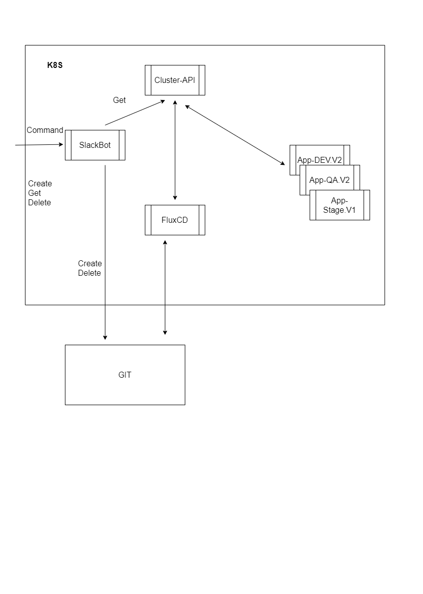

# High-Level Solution Design (HLD)

## Overview

This document outlines the high-level design of the Slack bot for automatization infrastructure tasks.

## System Flow

Пропонується наступна схема реализаціі.
У існуючому кластері розгортається FluxCD налаштований на конкретний Google storage (GCS).
Тобто саме створення K8S кластера та bootstrap FluxCD ми не розглядаемо.

Далі за допомогою FluxCD розгортаємо Slack-bot у окремому namespace (flux-slack)?.
Slack-bot повинен отримувати та виконувати три команди:

   - зробити деплой застосунка указанної версії у конкретному енвайроменті
   `create [env] [ver]`
   - видати лист працюючих застосунків і їх версій
   `get`
   - видалити застосунок
   `delete [env]`

Команди create да delete працюють із Git-ом як джерелом інформації для FluxCD
(Створюють потрібний каталог із файлами та змінюють конфігурацію для Flux).

Команда get оперуе із ClusterApi. 

Всі інши команді видать строку help.

Таким чином ми не створюемо інфраструктуру а тільки робим процедуру deploy уже створенного
та запакованного у HELM chart  застосунка.

## Diagram

## Components

- **GCP**: As cloud provider
- **GIT**: As version control system.
- **GIT Actions**: To implement testing and CI.
- **Terraform**: As IaC provisioning tool
- **GKE**: As Kubernetes service.
- **K8S**: As container orchestration system.
- **FluxCD**: To delivery solutions for Kubernetes.
- **SlackBOT**: As entry point to interact with users.

## Conclusion
The Slack bot for Preview Environment is designed to provide a efficient and real-time solution to automate infrastructure tasks.
